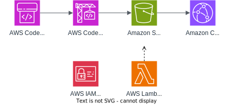

# VueQuickDeploy CloudFormation Template

This CloudFormation template sets up a CodePipeline for deploying a Vue app to Amazon S3 and CloudFront. Below is a detailed description of all the resources created by this template.



## Resources Deployed

- **CodePipeline**: CodePipeline for deploying the Vue app.
- **S3Bucket**: S3 bucket for storing the Vue app.
- **S3BucketPolicy**: Policy for the S3 bucket.
- **EmptyS3BucketCustomResource**: Custom resource to empty the S3 bucket on stack deletion.
- **EmptyS3BucketLambda**: Lambda function to empty the S3 bucket.
- **EmptyS3BucketLambdaRole**: IAM role for the Lambda function.
- **CloudFrontOriginAccessIdentity**: Origin access identity for CloudFront.
- **CodePipelineRole**: IAM role for CodePipeline.
- **CodeBuildProject**: CodeBuild project for building the Vue app.
- **CodeBuildRole**: IAM role for CodeBuild.
- **CloudFrontDistribution**: CloudFront distribution for serving the Vue app.

## Parameters

- **Workload**: The name of the workload being deployed, for tagging and naming. (i.e. MyApp)
- **Environment**: The environment type being deployed, for tagging. (i.e, dev, test, prod)
- **Deployer**: The user or tool deploying the resources, for tagging.
- **GitHubRepository**: The GitHub repository (owner/repo) to use for the pipeline.
- **GitHubBranch**: The branch of the GitHub repository to use.
- **GitHubConnectionArn**: The ARN of the CodeStar Connection for GitHub.
- **PriceClass**: The price class for the CloudFront distribution.
- **CodeBuildImage**: The Docker image used in CodeBuild.

## Outputs

- **CloudFrontDistributionUrl**: URL of the CloudFront distribution.

## Preparing Your Git Repository

1. Ensure your repository includes at least:
   - `package.json` with a build script (e.g., `"build": "vue-cli-service build"`).
   - A `src` directory containing your Vue app code.
   - A `public` directory (if default Vue structure is used).
   - Your `vue.config.js` file (optional) to specify output directories.
2. Add `dist/` and `node_modules/` to `.gitignore`.
3. Include a `buildspec.yml` file defining build steps for CodeBuild.
4. Ensure you run `npm install --save-dev vite`.

Your repository structure might look like:
```
my-vue-repo/
├── public/
├── src/
├── .gitignore
├── package.json
├── README.md
└── vue.config.js
```

### Example buildspec.yml

```yaml
version: 0.2

phases:
  install:
    runtime-versions:
      nodejs: 18
    commands:
      - echo "Installing dependencies with npm ci..."
      - npm ci
  build:
    commands:
      - echo "Building Vue app with Vite..."
      - npm run build
artifacts:
  base-directory: dist
  files:
    - '**/*'
```

## How to Deploy and Configure

1. **Set up a GitHub connection**:
   1. Go to the AWS CodePipeline console.
   2. In the navigation pane, choose **Connections**.
   3. Choose **Create connection**.
   4. Follow the instructions to connect to your GitHub account and authorize AWS CodePipeline.
   5. Copy the ARN of the created connection.
2. **Set up the CloudFormation Template**:
   1. Download or clone this repository locally.  
   2. Open the AWS CloudFormation console in your AWS account.  
   3. Create a new stack and upload the `cloudformation-template.yaml` file.  
3. **Specify stack parameters**, including:
   - `Workload` (the name of your deployed app)
   - `Environment` (dev, test, prod, etc.)
   - `GitHubRepository` (owner/repo)
   - `GitHubBranch` (branch to pull code from)
   - `GitHubConnectionArn` (the ARN of your CodeStar Connection)
4. **Review and create** the stack. CloudFormation will provision all resources.

## Running the Pipeline

Once the stack is created:
1. **Open CodePipeline** in the AWS Management Console.
2. The pipeline will automatically start. It checks out your code, builds it, and deploys artifacts to S3.
3. **CloudFront** will serve your site from the new bucket. You can find the distribution domain in the CloudFront console.

## Estimated Cost

- **S3**: Storage and data transfer costs.  
- **CloudFront**: Pay for data transfer and requests.  
- **CodeBuild**: Cost depends on build minutes used.  
- **CodePipeline**: Minimal monthly charge per active pipeline.  
All services are pay-as-you-go. Refer to the AWS Pricing pages for up-to-date and specific details.

## Cleaning Up Resources

1. **Delete the CloudFormation stack** to remove all related AWS resources automatically.  
2. **Confirm S3 bucket removal** in case any artifacts remain.  


## GenAI Disclaimer

The code in this repository was edited using generative AI tools.